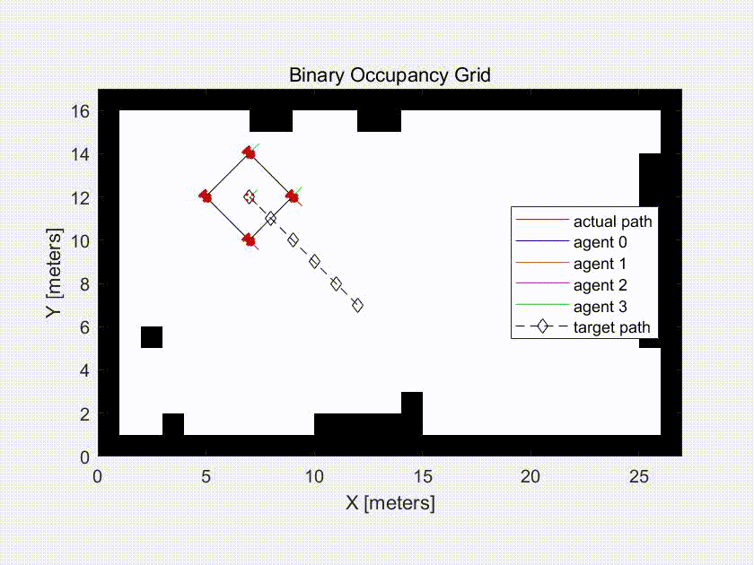

## Agent formation control implementation in MATLAB

### Introduction
The MATLAB implementation of the control algorithm tests the agent formation control in 4 different cases.
- **case 1**: straight path followed by a curved path.
- **case 2**: straight path
- **case 3**: circular path
- **case 4**: combination of straight and circular paths

### Usage 
- Running `case_1.m` to `case_4.m` allows you to simulate a robot formation without AMCL (Adaptive Monte Carlo Localization). 

- Running `case_1_mcl.m` to `case_4_mcl.m` allows you to simulate a robot formation using AMCL.

- After the program has finished running, execute `show_error.m` to obtain the error plot. 

### Results

##### Case 1

##### Case 2

##### Case 3

##### Case 4
